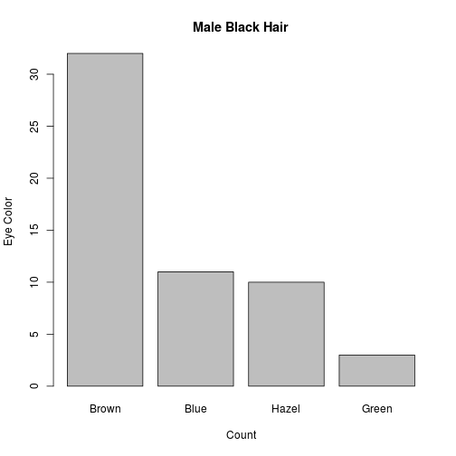

Developing Data Products Assigment
========================================================
author: Pau Rabassa
date: June 21 2015

Aim of the shinyapp
======================================================== 

This presentation describes [this shinyapp](https://paurabassa.shinyapps.io/project) 
developed as the final assigment of the course *Developing Data Products*. 

The app that I developed uses the shinny interface to visualize the data 
in the `HairEyeColor` dataset. 

Dataset description
==========================

The `HairEyeColor` dataset is a 3-dimensional array resulting from cross-tabulating 592 
observations on 3 variables. 
- Sex
- Eye Color
- Hair Color

The Hair x Eye table comes from a survey of students at the University of Delaware 
reported by Snee (1974).

Exemple of barplot for Blak Hair Males
========================================================

 

Further Developement
========================================================

The app could be extended and improved in several directions: 

- Modify the variable of the render plot, in orther to plot the percentage of 
Hair color or sex with respect to the other variables. 
- Introduce new tab that allows to plot with respect both sexes or all hair 
colors at the same time. 
- Introduce option to plot all the boxplots as a percentage over the total. 
